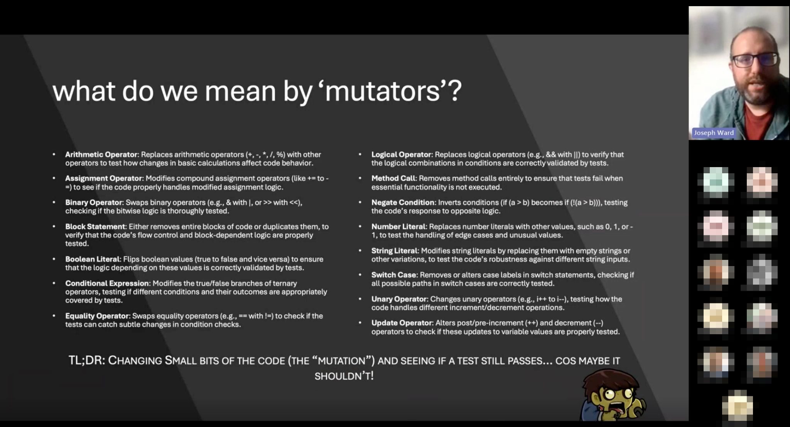
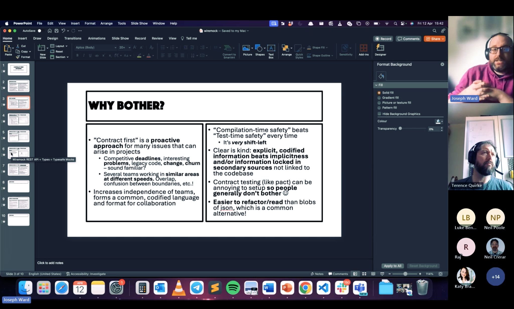
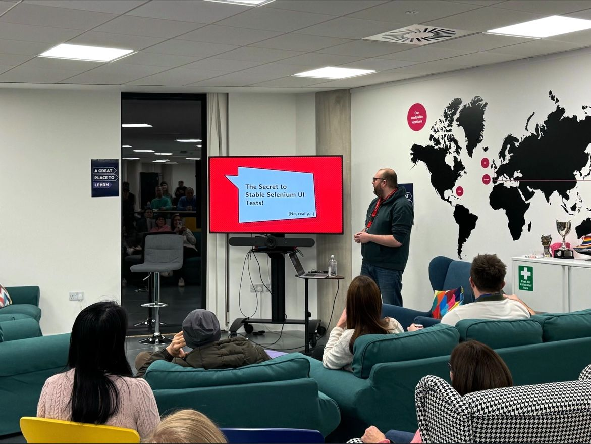
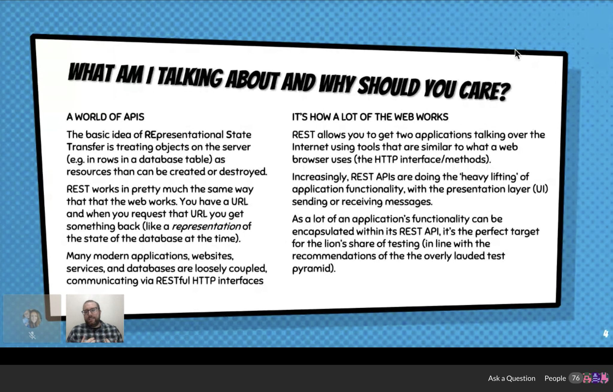
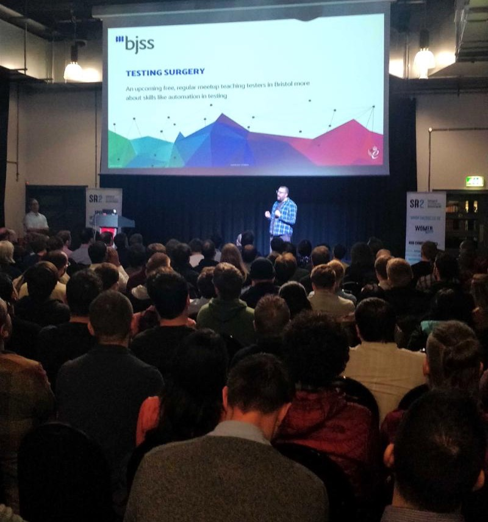
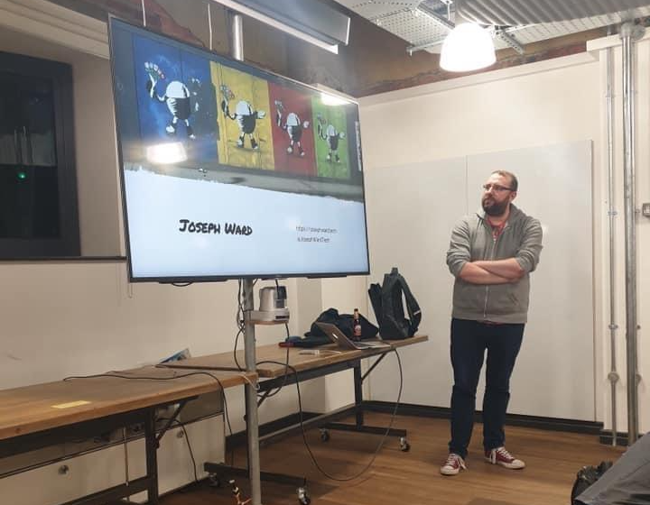
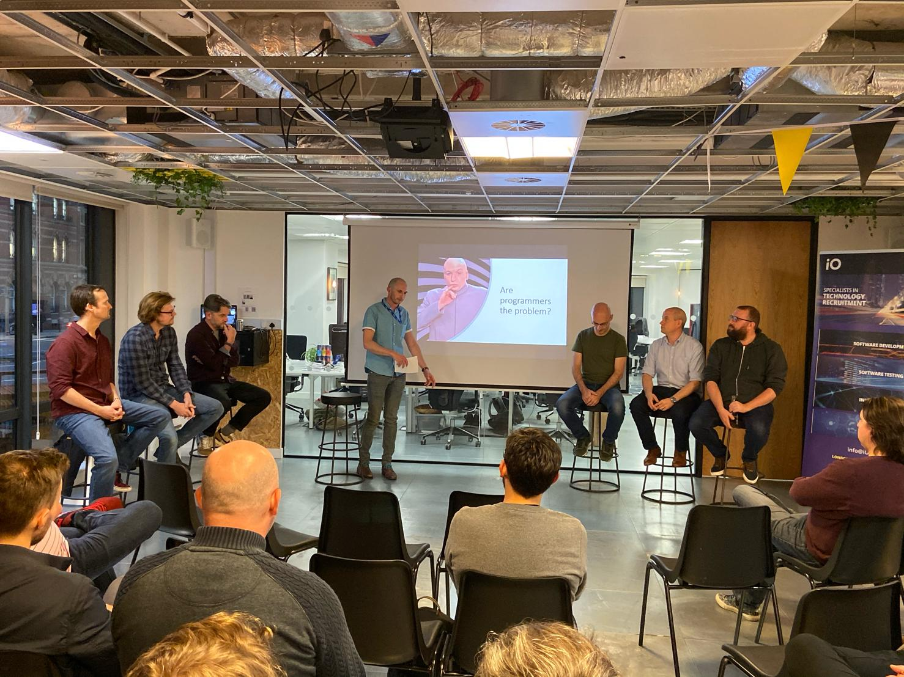
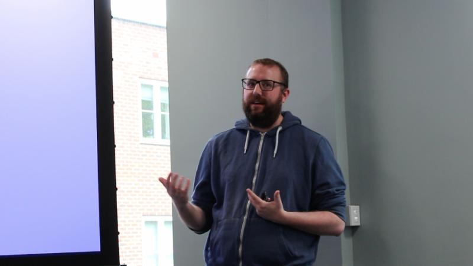
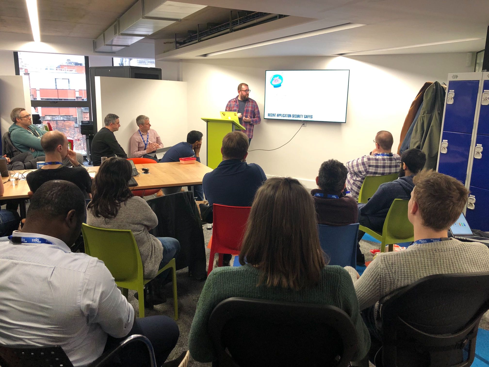
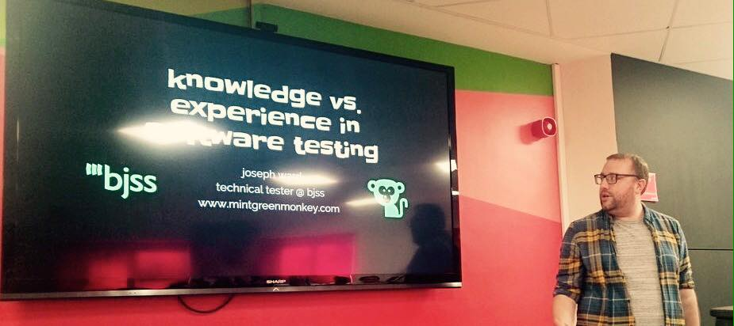

As a speaker, I prepare talks that I think will appeal to the software testing community. I also participate in debates about technology. Please get in touch if any of these sound interesting for your local meetup, or if you're looking for a tester who can add some strong opinions to your panel.

## Testing Your Tests with Stryker Mutator

***2024***

A demonstration of Strker Mutator and how it can "test your tests," revealing gaps in coverage and challenging hidden assumptions. Remember: high test coverage doesn’t always mean useful coverage!

## Contract-First Mocks using TypeScript, OpenAPI, and Wiremock

***2024***

An introduction to "Contract-First" Mocks and how they can improve software testing by promoting collaboration and ensuring mock contract accuracy earlier -- at compile time instead of during testing.

## The Secret to Stable Seleniu UI Tests (No, really...)

***2024***

An examination of network manipulation commands in Cypress and Playwright and how they can be used in Selenium to enhance test reliability.

This talk also became the topic of a blog post, which can he found [here](https://josephward.tech/2024-01-21-harmonising-selenium/).

## Introduction to REST Testing: A Beginner's Guide

***2021***

A whistle-stop tour of REST API testing, including basic concepts, tooling overviews, example code, and benefits.

## Testing Surgery (⚡️ talk)

***2020***

Talking about Testing Surgery, a planned meetup to coach local testers about automation in testing (sadly delayed due to COVID-19).

## Snapshot Testing a REST API 

***2019***

Discussing the advantages, and disadvantages, of snapshot testing with the example of REST API tests.

## Hacking for Muggles (⚡️ talk)

***2019***

A concise introduction to the skills needed to identify, and exploit, security vulnerabilities.

## Are Programmers the Problem?

***2019***

Panel member in a debate concerning ethics in the modern IT industry. 

## What is Test & Assurance?

***2019***

Examining “what is test & assurance?” using BJSS’ capability culture as an example.

## Squeezing the OWASP Juice Shop: pentesting an (intentionally) insecure webapp

***2019***

Introducing the OWASP Juice Shop and its usefulness as a technical testing bed.

## Knowledge vs. Experience in Software Testing (⚡️ talk)

***2018***

A short story about the differences between knowledge and experience in software testing.

